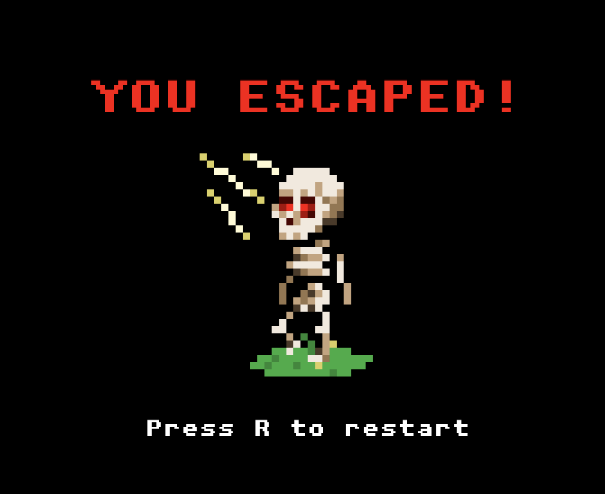

# The Peaceful Pursuit of Boris Bones

## Table of Contents

- [Description](#description)
- [Screenshots](#screenshots)
- [Built With](#built-with)
- [Getting Started](#getting-started)
  - [Prerequisites](#prerequisites)
  - [Installation](#installation)
- [Usage](#usage)
- [License](#license)
- [Acknowledgements](#acknowledgements)
- [Contacts](#contacts)

## Description

Hail, Adventurer! Master Skeletor has ruled over this decrepit dungeon for 1,000 years and nary a prisoner has escaped. The evil mastermind has ruled with a bony fist, supported by his skeletal minions. Adventurers often arrive to seek fame in challenging the lord of the dungeon and setting the prisoners free, but none have succeeded.

However, our hero Boris Bones is tired of the dampness of this cave. Tired by the constant seiges. Tired of the non-existent pay... just all over tired of this life! Or, well. Life so to speak. Its time he broke out of this evil lair once and for all, and felt the sun on his boney face!

The Peaceful Pursuit of Boris Bones was created for a Mintbean [Hiring Hackathon](https://mintbean.io/meets/d51762d5-b874-4cc1-a420-ff316600192f), running from August 24th - August 30th, that challenged us to create a 2D game utilizing JavaScript. [Mintbean](https://www.linkedin.com/company/mintbean/) is a developers' collective that provides support and mentorship for professional software develops within the industry. They've hosted 150+ Hackathons that helps new developers show off their skills and get connected with companies looking for new talent.

See a deployed version of the game [here!](https://borisbones.netlify.app/#/)

All sprites were created for this project by Vada Karlen.

## Screenshots

Level 1 of the game. The player needs to navigate to the door by moving and jumping around the level. Be sure to avoid the spikes, crabs, and wizards along the way!

Your goal is to escape the dungeon unscathed so Boris can live out his new, violence-free life.

## Built With

### Installation

1. Open the directory in your editor of choice and run `npm install` in the terminal.
2. Run `npm start` in the terminal and the game will open in your default browser!

## Usage

You goal is to make it out of the dungeon while avoiding getting hit or falling on traps!

- Left/Right - Moves Boris around the room.
- Up - Hop over obstacles and enemies.
- R - Restart from the beginning.

## License

<a href="https://choosealicense.com/licenses/mit/">MIT License</a>

## Acknowledgements

Thank you to [Mintbean](https://www.linkedin.com/company/mintbean/) for hosting the Hackathon that inspired this game and to Monarch Wadia for your help along the way! Special thanks to [Ben Michaels](https://www.linkedin.com/in/benjamin-michaels-88ab22a1/) for his early assistance in debugging Kaboom rendering as well.

## Contacts

### Bermet

 

### Grant Nichols

 

### Vada Karlen

 
